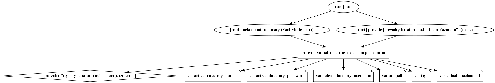

# Join the Virtual Machines to existing Active Directory Domain

Terraform module to join the virtual machines to an existing Active Directory domain using a Virtual Machine Extension.

OU Path to keep your virtual machines to desired Organization Unit. By default, all virtual machines go to Computers OU. You can manage by setting up variable to `ou_path = "OU=Computers,OU=HQ,OU=Europe,DC=Consoto,DC=COM"` a valid OU string.

> **[NOTE]**
> **This module now supports the meta arguments including `providers`, `depends_on`, `count`, and `for_each`.**
  
## Module Usage

```hcl
provider "azurerm" {
  features {}
}

module "virtual-machine" {
  source  = "kumarvna/virtual-machine/azurerm"
  version = "2.1.0"

  resource_group_name       = "rg-shared-westeurope-01"
  location                  = "westeurope"
  virtual_network_name      = "vnet-shared-hub-westeurope-001"
  subnet_name               = "snet-management"
  virtual_machine_name      = "win-machine"
  os_flavor                 = "windows"
  windows_distribution_name = "windows2019dc"
  virtual_machine_size      = "Standard_A2_v2"
  admin_username            = "azureadmin"
  admin_password            = "P@$$w0rd1234!"
  instances_count           = 1
  dns_servers               = ["10.1.3.4", "168.63.129.16"]

  nsg_inbound_rules = [
    {
      name                   = "rdp"
      destination_port_range = "3389"
      source_address_prefix  = "*"
    },

    {
      name                   = "http"
      destination_port_range = "80"
      source_address_prefix  = "*"
    },
  ]
}

module "domain-join" {
  source  = "kumarvna/domain-join/azurerm"
  version = "1.1.0"

  virtual_machine_id        = element(concat(module.virtual-machine.windows_virtual_machine_ids, [""]), 0)
  active_directory_domain   = "consoto.com"
  active_directory_username = "azureadmin"
  active_directory_password = "P@$$w0rd1234!"

  # Adding TAG's to your Azure resources (Required)
  # ProjectName and Env are already declared above, to use them here or create a varible. 
  tags = {
    ProjectName  = "demo-project"
    Env          = "dev"
    Owner        = "user@example.com"
    BusinessUnit = "CORP"
    ServiceClass = "Gold"
  }
}
```

## Requirements

Name | Version
-----|--------
terraform | >= 0.13
azurerm | >= 2.59.0

## Providers

| Name | Version |
|------|---------|
azurerm | >= 2.59.0

## Inputs

Name | Description | Type | Default
---- | ----------- | ---- | -------
`virtual_machine_id` |The resource ID of the Virtual Machine| string | `""`
`active_directory_domain`|The name of the Active Directory domain to join|string | `""`
`ou_path`|An organizational unit (OU) within an Active Directory to place computers|string|`null`
`active_directory_username`|The username of an account with permissions to bind machines to the Active Directory Domain|string|`""`
`active_directory_password`|The password of the account with permissions to bind machines to the Active Directory Domain|string|`""`
`Tags`|A map of tags to add to all resources|map|`{}`

## Outputs

|Name | Description|
|---- | -----------|
`windows_vm_extension_id`|Resource ID of Virtual Machine extension

## Resource Graph



## Authors

Originally created by [Kumaraswamy Vithanala](mailto:kumarvna@gmail.com)

## Other resources

* [Active Directory Setup](https://cloudblogs.microsoft.com/industry-blog/en-gb/technetuk/2016/06/08/setting-up-active-directory-via-powershell/)
* [Join a Windows Server virtual machine to an Azure Active Directory](https://docs.microsoft.com/en-us/azure/active-directory-domain-services/join-windows-vm-template)
* [Virtual Machine Extensions](https://docs.microsoft.com/en-us/azure/virtual-machines/extensions/features-windows#:~:text=Azure%20virtual%20machine%20(VM)%20extensions,VM%20extension%20can%20be%20used.)
* [Terraform AzureRM Provider Documentation](https://www.terraform.io/docs/providers/azurerm/index.html)
